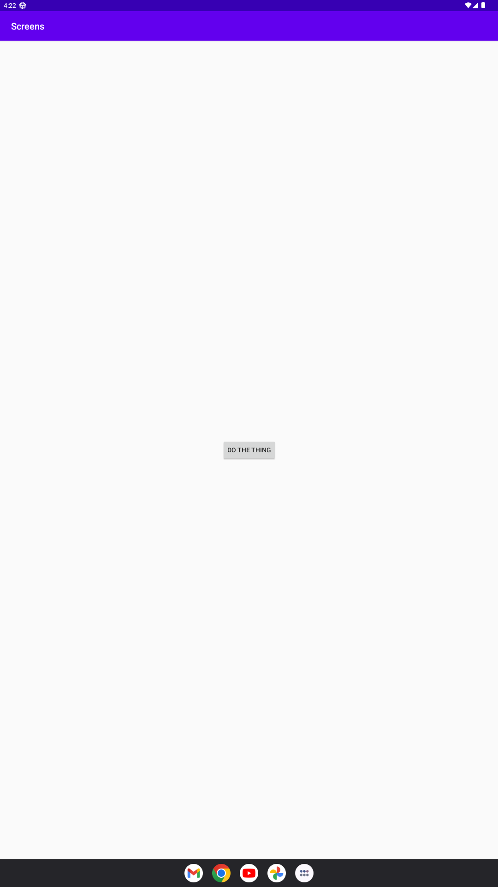
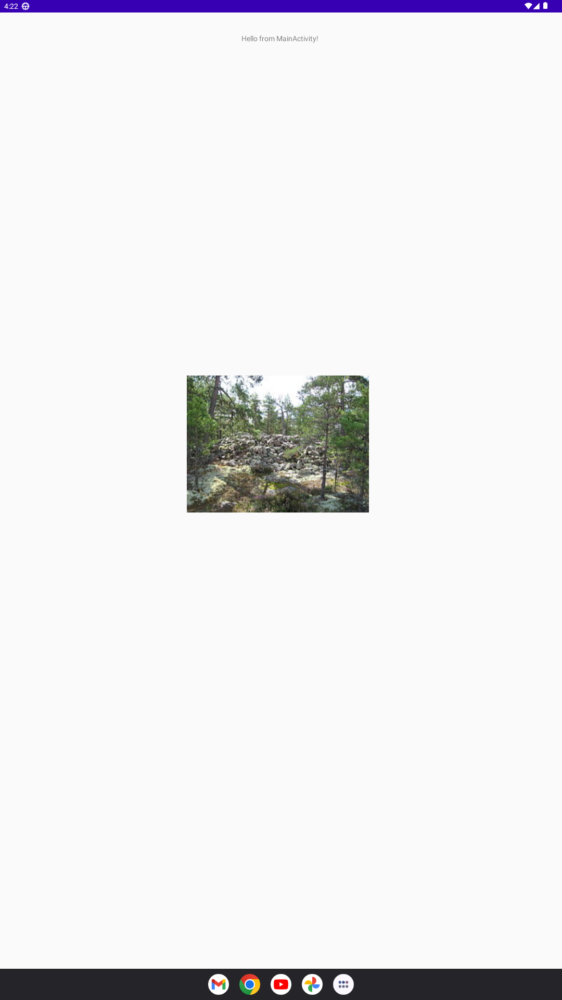

# Rapport

**Skriv din rapport här!**

_Du kan ta bort all text som finns sedan tidigare_.


- började med att lägga till en andra activity som jag döpte till SecondActivity

secondactivity.java
```
package com.example.screens;

import android.app.Activity;

public class SecondActivity extends Activity {
}
```

AndroidManifest.xml
```
<activity android:name=".SecondActivity">
    <intent-filter>
        <action android:name="android.intent.action.VIEW" />
        <category android:name="android.intent.category.DEFAULT" />
    </intent-filter>
</activity>
```

- lade sedan till en knapp i main activity soms startar second activity
MainActivity.java
```
// function to start second activity
public void startSecondActivity(android.view.View view) {
    // create an intent to start second activity
    android.content.Intent intent = new android.content.Intent(this, SecondActivity.class);
    // add data to intent
    intent.putExtra("com.example.screens.MESSAGE", "Hello from MainActivity!");

    // start second activity
    startActivity(intent);
}
@Override
protected void onCreate(Bundle savedInstanceState) {
    super.onCreate(savedInstanceState);
    setContentView(R.layout.activity_main);

    Button button = findViewById(R.id.button);

    // set onClickListener for button
    button.setOnClickListener(new android.view.View.OnClickListener() {
        @Override
        public void onClick(android.view.View view) {
            startSecondActivity(view);
        }
    });

}
```
seconactivity.java
```
@Override
protected void onCreate(android.os.Bundle savedInstanceState) {
    super.onCreate(savedInstanceState);
    setContentView(R.layout.activity_second);

    // get intent
    android.content.Intent intent = getIntent();
    // get data from intent
    String message = intent.getStringExtra("com.example.screens.MESSAGE");

    // set text of textView
    android.widget.TextView textView = findViewById(R.id.textView);
    textView.setText(message);


}
```

activity_main.xml
```
<Button
        android:id="@+id/button"
        android:layout_width="wrap_content"
        android:layout_height="wrap_content"
        android:text="do the thing"
        app:layout_constraintBottom_toBottomOf="parent"
        app:layout_constraintEnd_toEndOf="parent"
        app:layout_constraintStart_toStartOf="parent"
        app:layout_constraintTop_toTopOf="parent" />
```

activity_second.xml
```
<?xml version="1.0" encoding="utf-8"?>
<androidx.constraintlayout.widget.ConstraintLayout xmlns:android="http://schemas.android.com/apk/res/android"
    xmlns:app="http://schemas.android.com/apk/res-auto"
    xmlns:tools="http://schemas.android.com/tools"
    android:layout_width="match_parent"
    android:layout_height="match_parent">

    <TextView
        android:id="@+id/textView"
        android:layout_width="wrap_content"
        android:layout_height="wrap_content"
        android:layout_marginTop="40dp"
        android:text="TextView"
        app:layout_constraintEnd_toEndOf="parent"
        app:layout_constraintHorizontal_bias="0.498"
        app:layout_constraintStart_toStartOf="parent"
        app:layout_constraintTop_toTopOf="parent" />
</androidx.constraintlayout.widget.ConstraintLayout>
```


- lade till en imageview i secondactivity
app/build.gradle - lade till glide för att kunna hämta bilder online
```
    implementation 'com.github.bumptech.glide:glide:4.12.0'
```

androidmanifest.xml - lade till internet access
```
<uses-permission android:name="android.permission.INTERNET" />    
```

secondactivity.java - laddar in bilden från internet. OBS inte min bild, tagen från wikipedia
```
// Initialize the ImageView widget
        ImageView imageView = findViewById(R.id.imageView);

        // Load the image using Glide
        Glide.with(this)
                .load("https://upload.wikimedia.org/wikipedia/commons/thumb/3/31/Ironagegrave-aland1.jpg/250px-Ironagegrave-aland1.jpg") 
                .into(imageView);
```

activity_second.xml
```
<ImageView
        android:id="@+id/imageView"
        android:layout_width="350dp"
        android:layout_height="350dp"
        android:layout_marginTop="37dp"
        app:layout_constraintBottom_toBottomOf="parent"
        app:layout_constraintEnd_toEndOf="parent"
        app:layout_constraintHorizontal_bias="0.492"
        app:layout_constraintStart_toStartOf="parent"
        app:layout_constraintTop_toBottomOf="@+id/textView"
        app:layout_constraintVertical_bias="0.314" />
        app:layout_constraintVertical_bias="0.401" />
```






